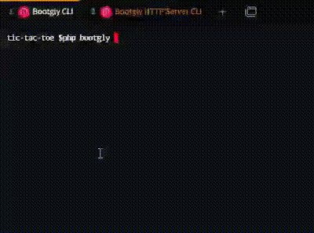
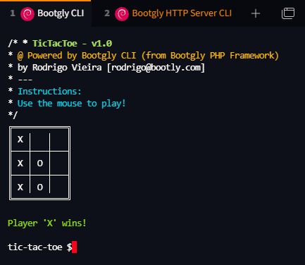

<p align="center">
  
</p>
<h1 align="center">Tic-Tac-Toe Game</h1>
<p align="center">
  <i>Powered by Bootgly CLI (from <a href="https://packagist.org/packages/bootgly/bootgly-php-framework">Bootgly PHP Framework</a>).</i>
</p>
<p align="center">
  <a href="https://packagist.org/packages/bootgly/bootgly-php-framework">
    
  </a>
</p>

---
## 🤔 About
This repository is part of [Bootgly Awesome][BOOTGLY_AWESOME].

The purpose was to demonstrate the power of Mouse Reporting abstraction of the Bootgly CLI which is part of the [Bootgly PHP Framework][BOOTGLY_PHP_FRAMEWORK].

> **This game uses only the mouse to play and has movements and click tracking.**

No additional extensions (like `ncurses`) were used, only `stty` system commands.

---

## 🚀 Deploy

### ⚙️ Install

```bash
composer install
```

or

```bash
git submodule update --init --recursive
```

### ▶️ Play

To start the game, in the root folder type in your terminal:

```bash
php bootgly
```

---

## 🟢 Requirements

### 🤝 Compatibility

Operation System | Compatibility
--- | ---
Linux (Debian based) | ✅
Windows | ❌
Unix | ❔

Terminal | Compatibility
--- | ---
Windows Terminal (WSL2) | ✅
Tabby |✅ 
GNOME |✅ 
Zsh, Fish, Konsole, Terminator |❔

✅ = Compatible

❌ = Incompatible

❔ = Untested

### 📦 Dependencies

- PHP 8.2+ ⚠️
- Opcache with JIT enabled (+50% performance) 👍

⚠️ = Required

👍 = Recommended

---

## 🖼 Preview

### Video


### Image


---

## 📃 License

The Bootgly PHP Framework is open-sourced software licensed under the [MIT license][MIT_LICENSE].


<!-- Links -->
[BOOTGLY_AWESOME]: https://github.com/bootgly/-awesome
[BOOTGLY_PHP_FRAMEWORK]: https://github.com/bootgly/bootgly-php-framework
[MIT_LICENSE]: https://opensource.org/licenses/MIT
